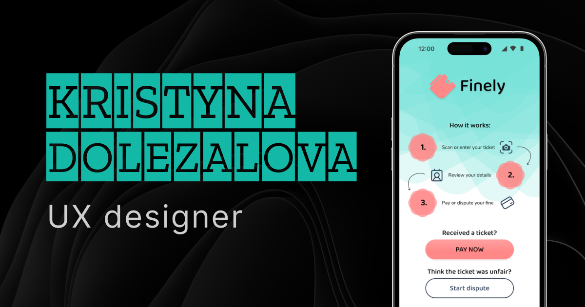

# Kristyna Dolezalova – Portfolio

UX/UI design and QA portfolio with case studies and a resume.

**Live:** https://dolekr.github.io



## Tech stack

Vue 3 · TypeScript · Vite · Tailwind CSS · PrimeVue · Vue Router

## Development

```sh
npm install
npm run dev           # start the dev server
npm run build         # type-check and build to dist/
npm run format        # format the code with Prettier
```

## Project structure

- `src/data/` – project case studies and resume content
- `src/components/` – page sections and UI components
- `src/views/` – Home and Resume pages

## Deployment

Every push to `main` is checked, built and published to GitHub Pages by GitHub Actions (`.github/workflows/deploy.yml`).
